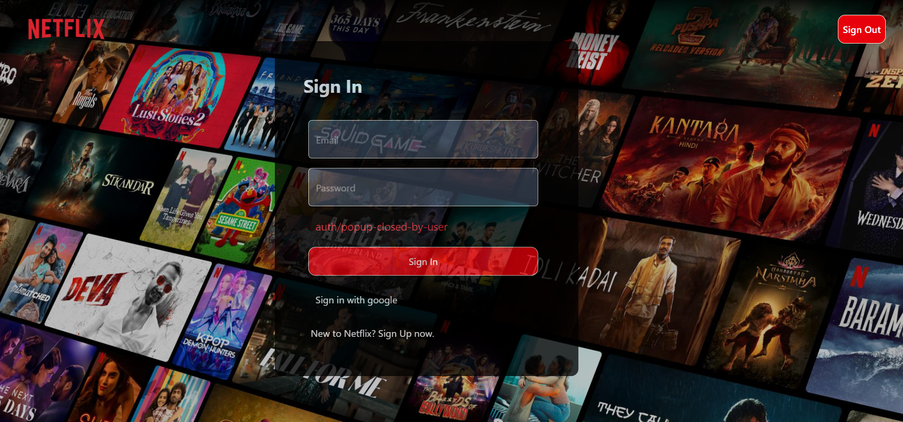
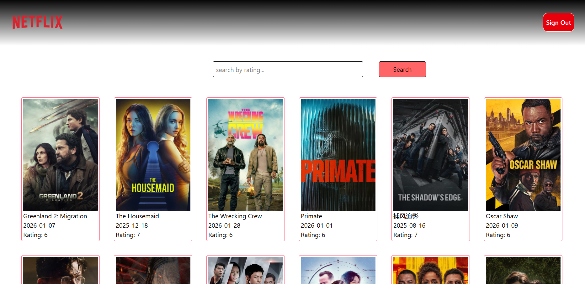
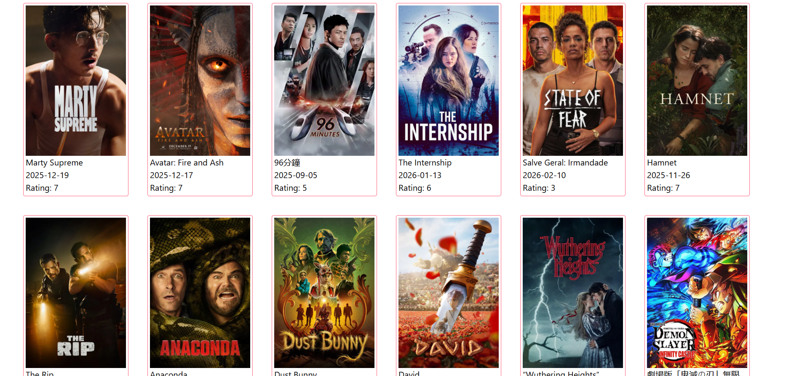
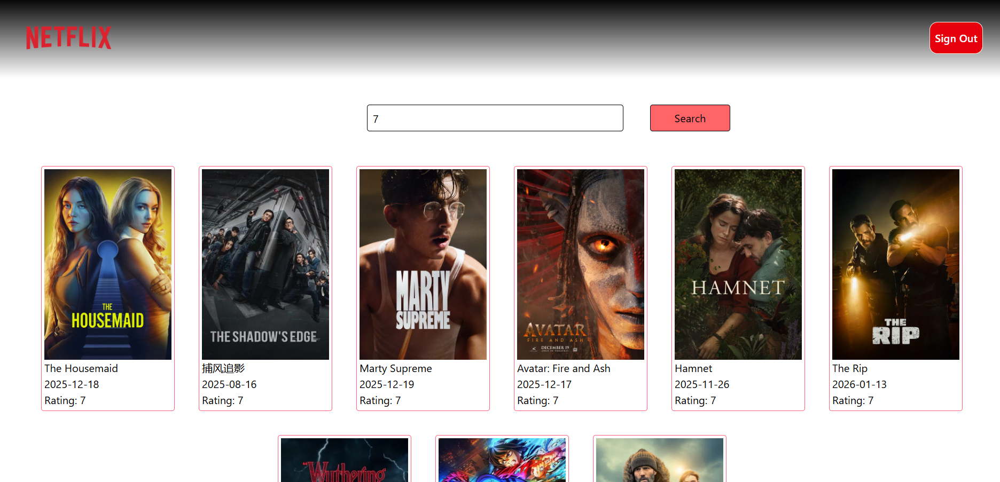
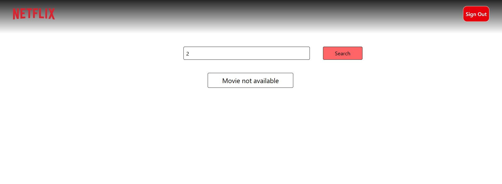

#netflixGPT
 // features
 -SignIn and SignUp page with validation
 -SignIn with Google using firebase
 -Store User SignIn data into a redux-dev-tool
 -List all movies from an API 
 -Display all movies into a card
 -Search movie by movie rating
 -SignOut

 //Description 
 -NetflixGPT is checks user authentication, where users sign in or sing in with google using Firebase After login, the app fetches real-time movie data from the TMDB API and displays trending and recommended content in a Movie card. And Search a movie by rating and display cards.User finally singout and redirect to the home page.

 
 
 
 
 
 
 
